<p align="center">
  
</p>

<h1 align="center">BlindDrop</h1>

<p align="center">
  <b>A free, private arena FPS written from scratch in C.</b><br>
  Four modes, eight maps, 34 weapons, team play with friends, bots that push, no telemetry.<br>
  <a href="https://github.com/ClaudiuJitea/BlindDrop/releases/latest"><b>Download for Linux and Windows</b></a>
</p>

<p align="center">
  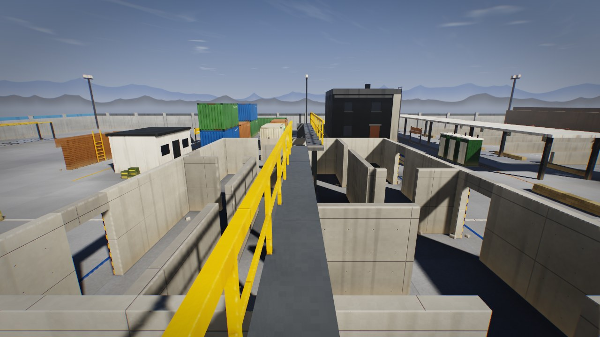
  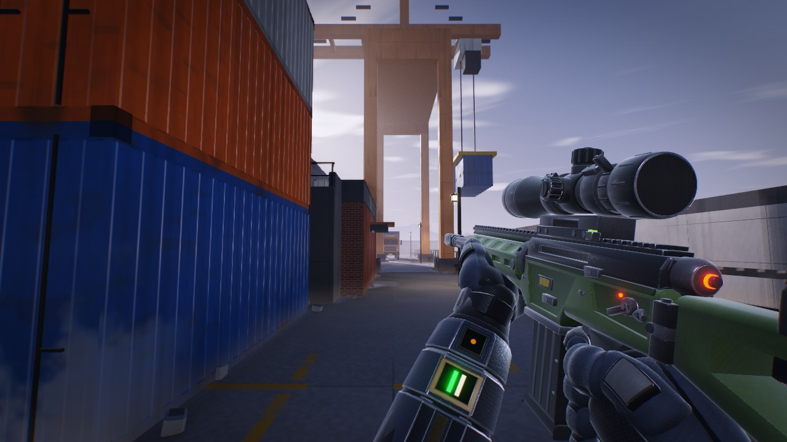
  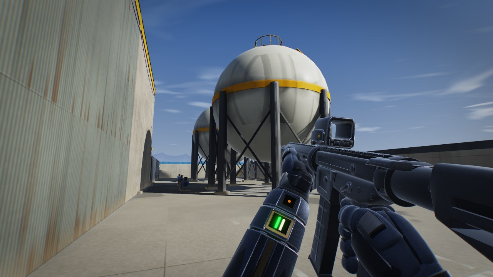
  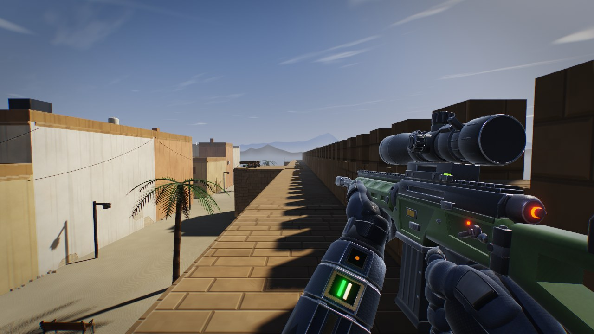
</p>

## New in 0.8.9

- **Arena is a military training zone:** an 88 m camp with a concrete shoot house and a catwalk
  over it, a six-lane firing range with pop-up targets, an obstacle course, a range control tower
  and a container village.
- **Six maps grew:** Harbor, Refinery, Citadel, Foundry and Compound now span 140 m, and Outpost
  80 m:
  - **Harbor:** a moored cargo ship you can board.
  - **Refinery:** LPG spheres and a tanker loading rack.
  - **Citadel:** a rampart you can walk along, bastions with cannons and a lower town.
  - **Foundry:** a rail yard and a coil warehouse.
  - **Compound:** anti-aircraft guns and a ruined village.
  - **Outpost:** a whole camp with a helipad, a motor pool, a fuel point and a satellite dish.
- **Climbing fixed:** ladders no longer knock you off at the top. All Outpost towers can be
  climbed, the Refinery tower stairs have headroom, and bots can now reach the Bazaar souk.
- **Pick one gun:** the Weapons setting is now ALL or any single gun + nades, such as AK-47 + NADES
  or DESERT EAGLE + NADES. Everyone, bots too, spawns with it.
- **Rebuilt guns:** a real banana magazine on the AK-47, and new R8 Revolver and Nova models.
- **Real hostages:** the three hostages are built like the operators: an older man, a young man
  and a woman, each in their own clothes. They wear bomb vests with a blinking detonator and kneel
  hooded with their hands tied. Once you cut them loose, the lamp turns green and they follow you.
- **Clearer wounds:** a dark red edge closes in as your health drops, the screen edge facing the
  shooter glows, and the hit marker points to them for a second.
- **More natural hands:** reshaped shoulders, a firing hand that sits behind the grip, and every
  finger on the grenade.

0.8.9 uses network protocol 25, so it can't play with older versions.

<p align="center">
  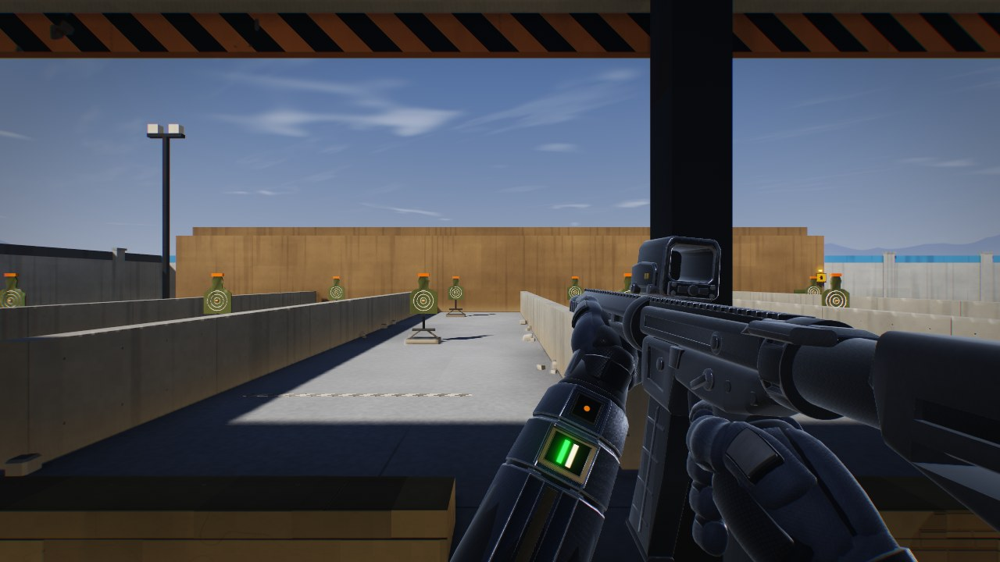
  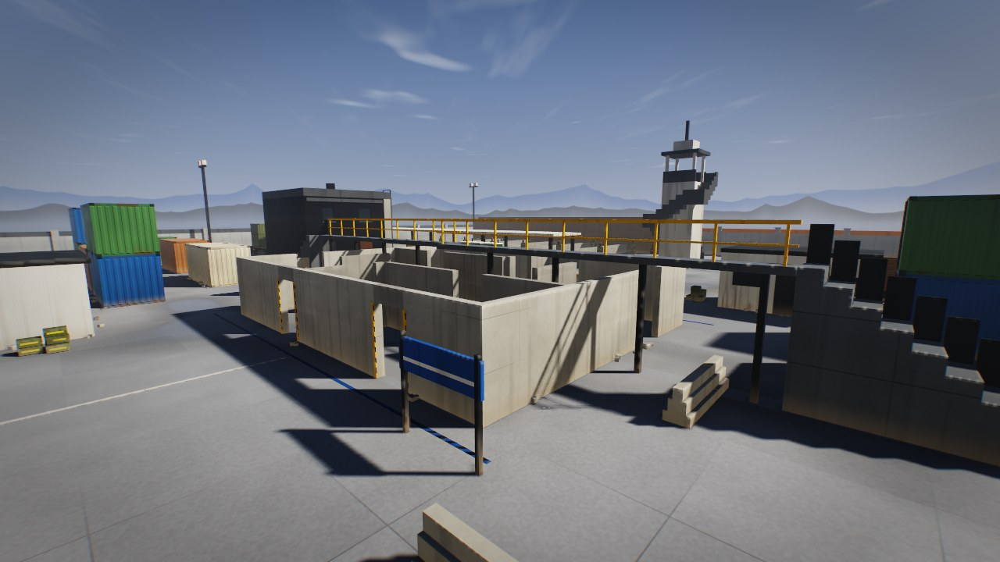
  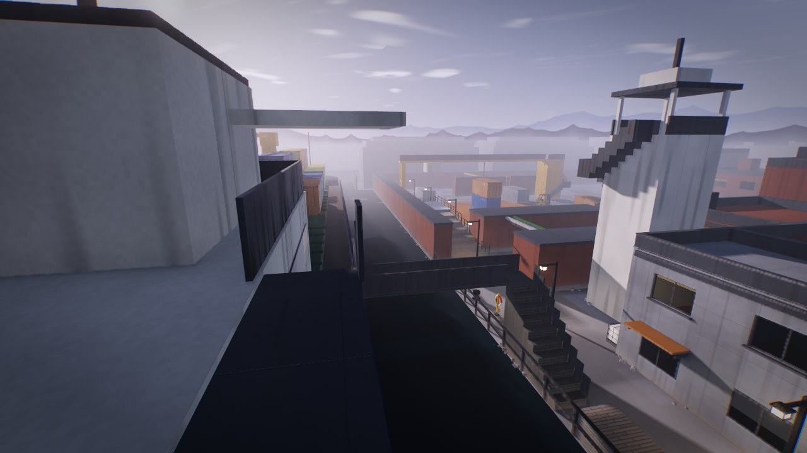
  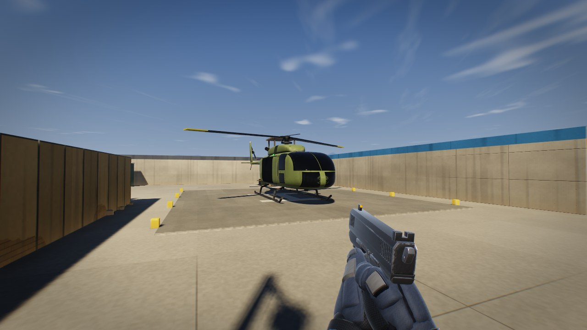
  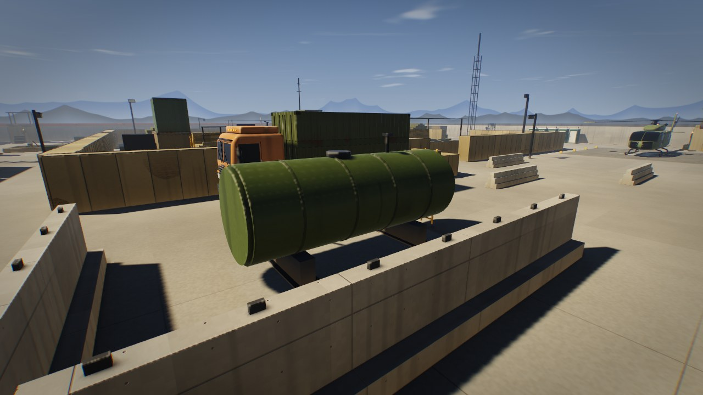
  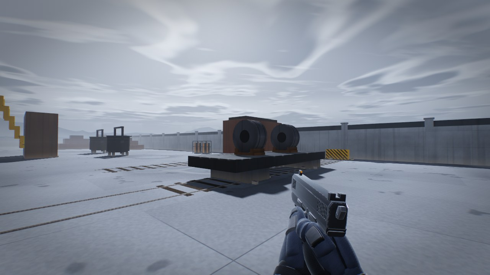
  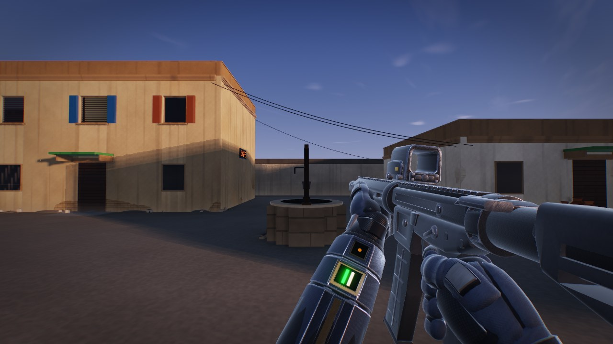
  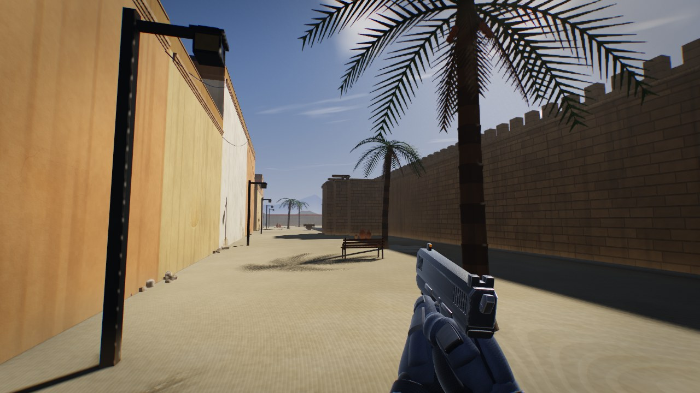
  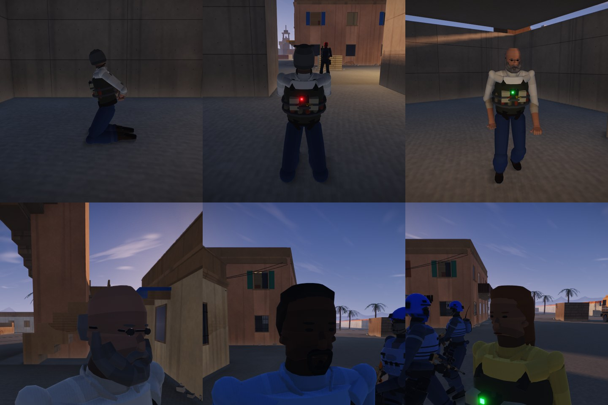
  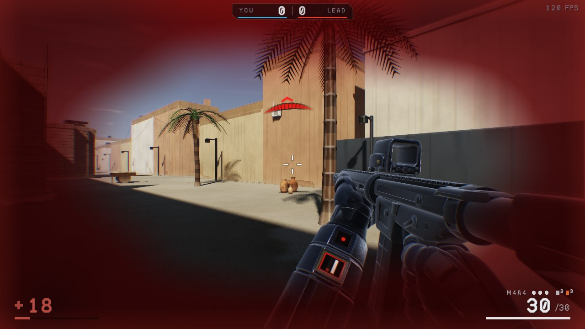
</p>

## The game

- **34 weapons, no unlocks:** 20 primaries, 10 pistols and 4 snipers, each with its own model,
  handling and recorded sound. Add frag, smoke and incendiary grenades and a knife.
- **Movement:** mantling, ladders, slides, `Q`/`E` leans, scopes and recoil you can learn.
- **Bots** hear and remember you, flank, throw grenades and use medical stations and ammo crates.
- **Your operator:** outfit, headgear, vest and pack under **Armory**. `V` toggles third person.
- **Forearm display:** kills this life, health and ammo bars, a radar or a compass, picked under
  **Settings > HUD** or **Armory > Gear**.
- **Modes:** four modes plus **Teams** and **Weapons** (all, or any one gun + nades) as
  settings, and a Gun Game ladder you build yourself.
- **No engine, no asset files:** maps are generated in code, and the models and sounds are built
  into the one binary.

| Mode | |
|---|---|
| **Deathmatch** | Respawns, first to the frag limit. With Teams on: ALPHA against BRAVO, up to 9 v 9. |
| **Elimination** | No respawns: last one (or last side) standing takes the round. |
| **Gun Game** | A kill moves you up your own ladder of guns, and a kill with the last one wins. |
| **Hostage Rescue** | A stealth mission for a squad of one to three: free three hostages and reach the helicopter. |

**Maps:** Arena (a military training zone), Foundry, Bazaar (an 84 m market quarter), Outpost,
Citadel, Harbor, Refinery and Compound. **Rotate** changes map each match.

<p align="center">
  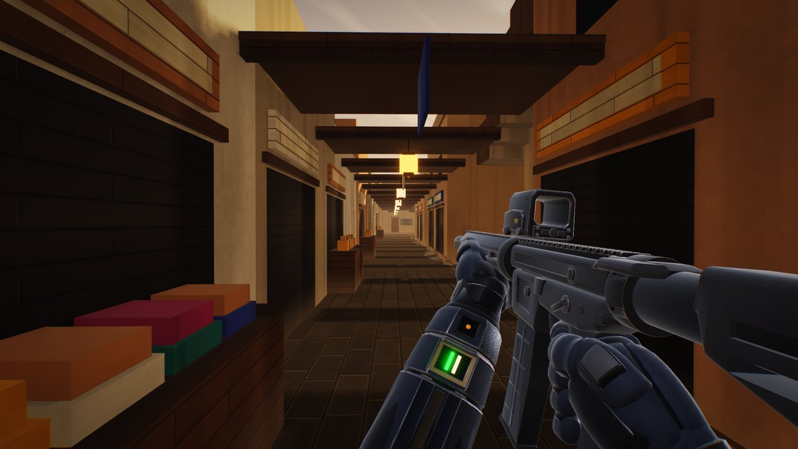
  
  
  
</p>

## Download and run

**Linux** x86_64 with glibc 2.38+ (Ubuntu 23.10+, Debian 13+, Fedora 39+, Arch, SteamOS 3.7+):

```sh
chmod +x ./blinddrop-linux-amd64 && ./blinddrop-linux-amd64
```

**Windows** 10 or 11, 64-bit: run `blinddrop-windows-amd64.exe`. It isn't code-signed, so
SmartScreen may ask you to confirm (More info > Run anyway). Windows can play and join, but hosting
needs Linux. Check any download with `sha256sum -c SHA256SUMS`.

If the frame rate is low, turn off **Post Effects** in Settings > Video.

## Multiplayer

**Host a game** starts a server on your PC (Linux only), **Games on your network** lists LAN games,
and **Join by address** takes `host:port` (forward UDP 31415 for internet play). Up to 8 players per
arena, with bots filling the empty places.

```sh
./blinddrop-linux-amd64 --server --mode elim --teams 1 --weapons sr0 --team-size 5
./blinddrop-linux-amd64 --server --mode gun --ladder ar1,ar15,pt2,sr2,kn0
./blinddrop-linux-amd64 --connect 192.168.1.50
```

Modes: `dm elim gun rescue`. Maps: `arena foundry bazaar outpost citadel harbor refinery compound
rotate`. A gun key, used by `--weapons` (one gun + nades, or `all`) and by each `--ladder` rung, is a
slot (`ar` primary, `pt` pistol, `sr` sniper, `gr` grenade, `kn` knife) plus its place in the Armory
list, counting from 0: `sr0` is the AWP. The menu is easier.

## Privacy

No telemetry, no update checks and no built-in servers. The game only uses the network when you join
or host, and only with the server you choose. That traffic isn't encrypted, and a server sees your
IP address and player name, so only join servers you trust.

## Build from source

Needs gcc 14+, make, and the EGL, GL and X11 development headers:

```sh
make build/game-x86_64 && ./build/game-x86_64
```

`code/game.c` `#include`s the parts under `code/` in a fixed order (a unity build). The meshes in
`code/models.h` are baked with `blender -b --factory-startup -P tools/build_models.py`, and the world
props with `tools/build_props.py`.

## Credits and license

BlindDrop is an independent modified version of
[skill-issue by codehamr](https://codehamr.com). It is not affiliated with or endorsed by codehamr.
It is licensed under the [PolyForm Noncommercial License 1.0.0](LICENSE): you can read, change and
share it for noncommercial purposes, but commercial use is not permitted.

Required Notice: Copyright (c) 2026 codehamr (https://codehamr.com)
